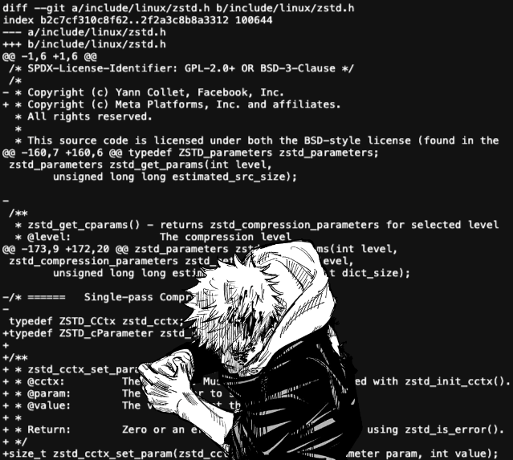

# diffgen

_Work in Progress_



Universal code changes description generation with LLMs. To be used everywhere, from GitHub repos to Linux Kernel mailing list.

## Install

1. Python 3.10 or later required
2. `pip install git+https://github.com/paulopacitti/diffgen.git`
3. `diffgen init`

A new file `$HOME/.config/diffgen/config.json` will be created. Insert the LLM API key, url... Any [litellm](https://docs.litellm.ai/docs/providers) supported model is accepted.

## Usage

```sh
$ diffgen -h
Usage: diffgen [OPTIONS] COMMAND [ARGS]...

Options:
--install-completion Install completion for the current shell.
--show-completion Show completion for the current shell, to copy it or
customize the installation.
-h, --help Show this message and exit.

Commands:
commit Generate a commit message.
pr Generate a pull request description.
$ git checkout fix/llm-api-client
# perform code changes...
$ git add . # commit message will be generated based on files on the staging area
$ diffgen commit # generate a commit message
$ diffgen commit | xargs -I {} git commit -m "{}" # you can pipe the output
$ git reset --soft HEAD~1 # undo commit
$ diffgen commit -c -e "this is a bugfix in the LLM API client" # -c insert context, -e open GIT_EDITOR with the generated message
$ diffgen pr | pbcopy # copy to clipboard (on macOS) to paste in a GitHub PR or Linux Kernel patch submission
```
